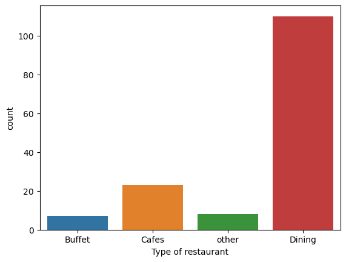
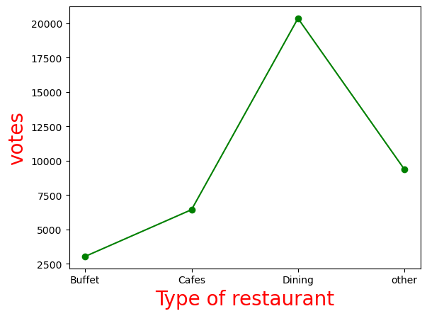
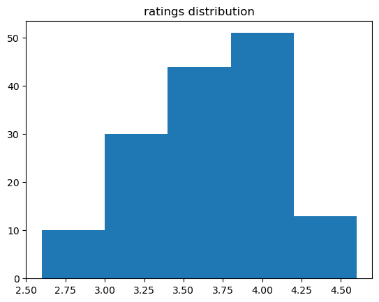
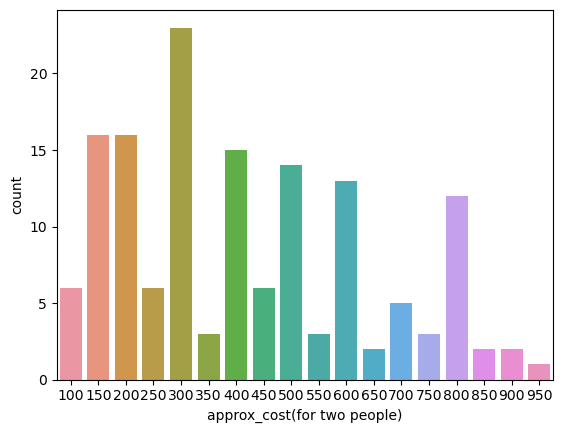
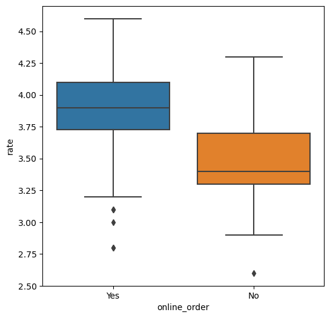
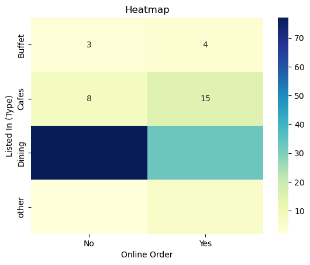

```python
import pandas as pd
import numpy as np
import matplotlib.pyplot as plt
import seaborn as sns
```


```python
df = pd.read_csv("Zomato data .csv")
```


```python
print(df)
```

                          name online_order book_table   rate  votes  \
    0                    Jalsa          Yes        Yes  4.1/5    775   
    1           Spice Elephant          Yes         No  4.1/5    787   
    2          San Churro Cafe          Yes         No  3.8/5    918   
    3    Addhuri Udupi Bhojana           No         No  3.7/5     88   
    4            Grand Village           No         No  3.8/5    166   
    ..                     ...          ...        ...    ...    ...   
    143       Melting Melodies           No         No  3.3/5      0   
    144        New Indraprasta           No         No  3.3/5      0   
    145           Anna Kuteera          Yes         No  4.0/5    771   
    146                 Darbar           No         No  3.0/5     98   
    147          Vijayalakshmi          Yes         No  3.9/5     47   
    
         approx_cost(for two people) listed_in(type)  
    0                            800          Buffet  
    1                            800          Buffet  
    2                            800          Buffet  
    3                            300          Buffet  
    4                            600          Buffet  
    ..                           ...             ...  
    143                          100          Dining  
    144                          150          Dining  
    145                          450          Dining  
    146                          800          Dining  
    147                          200          Dining  
    
    [148 rows x 7 columns]
    


```python
df
```


<div>
<style scoped>
    .dataframe tbody tr th:only-of-type {
        vertical-align: middle;
    }

    .dataframe tbody tr th {
        vertical-align: top;
    }

    .dataframe thead th {
        text-align: right;
    }
</style>
<table border="1" class="dataframe">
  <thead>
    <tr style="text-align: right;">
      <th></th>
      <th>name</th>
      <th>online_order</th>
      <th>book_table</th>
      <th>rate</th>
      <th>votes</th>
      <th>approx_cost(for two people)</th>
      <th>listed_in(type)</th>
    </tr>
  </thead>
  <tbody>
    <tr>
      <th>0</th>
      <td>Jalsa</td>
      <td>Yes</td>
      <td>Yes</td>
      <td>4.1/5</td>
      <td>775</td>
      <td>800</td>
      <td>Buffet</td>
    </tr>
    <tr>
      <th>1</th>
      <td>Spice Elephant</td>
      <td>Yes</td>
      <td>No</td>
      <td>4.1/5</td>
      <td>787</td>
      <td>800</td>
      <td>Buffet</td>
    </tr>
    <tr>
      <th>2</th>
      <td>San Churro Cafe</td>
      <td>Yes</td>
      <td>No</td>
      <td>3.8/5</td>
      <td>918</td>
      <td>800</td>
      <td>Buffet</td>
    </tr>
    <tr>
      <th>3</th>
      <td>Addhuri Udupi Bhojana</td>
      <td>No</td>
      <td>No</td>
      <td>3.7/5</td>
      <td>88</td>
      <td>300</td>
      <td>Buffet</td>
    </tr>
    <tr>
      <th>4</th>
      <td>Grand Village</td>
      <td>No</td>
      <td>No</td>
      <td>3.8/5</td>
      <td>166</td>
      <td>600</td>
      <td>Buffet</td>
    </tr>
    <tr>
      <th>...</th>
      <td>...</td>
      <td>...</td>
      <td>...</td>
      <td>...</td>
      <td>...</td>
      <td>...</td>
      <td>...</td>
    </tr>
    <tr>
      <th>143</th>
      <td>Melting Melodies</td>
      <td>No</td>
      <td>No</td>
      <td>3.3/5</td>
      <td>0</td>
      <td>100</td>
      <td>Dining</td>
    </tr>
    <tr>
      <th>144</th>
      <td>New Indraprasta</td>
      <td>No</td>
      <td>No</td>
      <td>3.3/5</td>
      <td>0</td>
      <td>150</td>
      <td>Dining</td>
    </tr>
    <tr>
      <th>145</th>
      <td>Anna Kuteera</td>
      <td>Yes</td>
      <td>No</td>
      <td>4.0/5</td>
      <td>771</td>
      <td>450</td>
      <td>Dining</td>
    </tr>
    <tr>
      <th>146</th>
      <td>Darbar</td>
      <td>No</td>
      <td>No</td>
      <td>3.0/5</td>
      <td>98</td>
      <td>800</td>
      <td>Dining</td>
    </tr>
    <tr>
      <th>147</th>
      <td>Vijayalakshmi</td>
      <td>Yes</td>
      <td>No</td>
      <td>3.9/5</td>
      <td>47</td>
      <td>200</td>
      <td>Dining</td>
    </tr>
  </tbody>
</table>
<p>148 rows × 7 columns</p>
</div>


```python
#converting the data type of column-rate
```


```python
def handleRate(value):
    value = str(value).split('/')
    value = value[0];
    return float(value)
df['rate']=df['rate'].apply(handleRate)
print(df.head())
```

                        name online_order book_table  rate  votes  \
    0                  Jalsa          Yes        Yes   4.1    775   
    1         Spice Elephant          Yes         No   4.1    787   
    2        San Churro Cafe          Yes         No   3.8    918   
    3  Addhuri Udupi Bhojana           No         No   3.7     88   
    4          Grand Village           No         No   3.8    166   
    
       approx_cost(for two people) listed_in(type)  
    0                          800          Buffet  
    1                          800          Buffet  
    2                          800          Buffet  
    3                          300          Buffet  
    4                          600          Buffet  
    


```python
df.info()
```

    <class 'pandas.core.frame.DataFrame'>
    RangeIndex: 148 entries, 0 to 147
    Data columns (total 7 columns):
     #   Column                       Non-Null Count  Dtype  
    ---  ------                       --------------  -----  
     0   name                         148 non-null    object 
     1   online_order                 148 non-null    object 
     2   book_table                   148 non-null    object 
     3   rate                         148 non-null    float64
     4   votes                        148 non-null    int64  
     5   approx_cost(for two people)  148 non-null    int64  
     6   listed_in(type)              148 non-null    object 
    dtypes: float64(1), int64(2), object(4)
    memory usage: 8.2+ KB
    


```python
#Type of Restaurant
```


```python
df.head()
```


<div>
<style scoped>
    .dataframe tbody tr th:only-of-type {
        vertical-align: middle;
    }

    .dataframe tbody tr th {
        vertical-align: top;
    }

    .dataframe thead th {
        text-align: right;
    }
</style>
<table border="1" class="dataframe">
  <thead>
    <tr style="text-align: right;">
      <th></th>
      <th>name</th>
      <th>online_order</th>
      <th>book_table</th>
      <th>rate</th>
      <th>votes</th>
      <th>approx_cost(for two people)</th>
      <th>listed_in(type)</th>
    </tr>
  </thead>
  <tbody>
    <tr>
      <th>0</th>
      <td>Jalsa</td>
      <td>Yes</td>
      <td>Yes</td>
      <td>4.1</td>
      <td>775</td>
      <td>800</td>
      <td>Buffet</td>
    </tr>
    <tr>
      <th>1</th>
      <td>Spice Elephant</td>
      <td>Yes</td>
      <td>No</td>
      <td>4.1</td>
      <td>787</td>
      <td>800</td>
      <td>Buffet</td>
    </tr>
    <tr>
      <th>2</th>
      <td>San Churro Cafe</td>
      <td>Yes</td>
      <td>No</td>
      <td>3.8</td>
      <td>918</td>
      <td>800</td>
      <td>Buffet</td>
    </tr>
    <tr>
      <th>3</th>
      <td>Addhuri Udupi Bhojana</td>
      <td>No</td>
      <td>No</td>
      <td>3.7</td>
      <td>88</td>
      <td>300</td>
      <td>Buffet</td>
    </tr>
    <tr>
      <th>4</th>
      <td>Grand Village</td>
      <td>No</td>
      <td>No</td>
      <td>3.8</td>
      <td>166</td>
      <td>600</td>
      <td>Buffet</td>
    </tr>
  </tbody>
</table>
</div>


```python
sns.countplot(x=df['listed_in(type)'])
plt.xlabel("Type of restaurant")
```


    Text(0.5, 0, 'Type of restaurant')


    

    


```python
#Hence majority of the restaurant falls in dining category
```


```python
df.head()
```


<div>
<style scoped>
    .dataframe tbody tr th:only-of-type {
        vertical-align: middle;
    }

    .dataframe tbody tr th {
        vertical-align: top;
    }

    .dataframe thead th {
        text-align: right;
    }
</style>
<table border="1" class="dataframe">
  <thead>
    <tr style="text-align: right;">
      <th></th>
      <th>name</th>
      <th>online_order</th>
      <th>book_table</th>
      <th>rate</th>
      <th>votes</th>
      <th>approx_cost(for two people)</th>
      <th>listed_in(type)</th>
    </tr>
  </thead>
  <tbody>
    <tr>
      <th>0</th>
      <td>Jalsa</td>
      <td>Yes</td>
      <td>Yes</td>
      <td>4.1</td>
      <td>775</td>
      <td>800</td>
      <td>Buffet</td>
    </tr>
    <tr>
      <th>1</th>
      <td>Spice Elephant</td>
      <td>Yes</td>
      <td>No</td>
      <td>4.1</td>
      <td>787</td>
      <td>800</td>
      <td>Buffet</td>
    </tr>
    <tr>
      <th>2</th>
      <td>San Churro Cafe</td>
      <td>Yes</td>
      <td>No</td>
      <td>3.8</td>
      <td>918</td>
      <td>800</td>
      <td>Buffet</td>
    </tr>
    <tr>
      <th>3</th>
      <td>Addhuri Udupi Bhojana</td>
      <td>No</td>
      <td>No</td>
      <td>3.7</td>
      <td>88</td>
      <td>300</td>
      <td>Buffet</td>
    </tr>
    <tr>
      <th>4</th>
      <td>Grand Village</td>
      <td>No</td>
      <td>No</td>
      <td>3.8</td>
      <td>166</td>
      <td>600</td>
      <td>Buffet</td>
    </tr>
  </tbody>
</table>
</div>


```python
grouped_data = df.groupby('listed_in(type)')['votes'].sum()
result = pd.DataFrame({'votes': grouped_data})
plt.plot(result, c='green', marker='o')
plt.xlabel("Type of restaurant", c="red", size=20)
plt.ylabel("votes", c="red", size=20)

```


    Text(0, 0.5, 'votes')


    

    


```python
#Hence dining restaurants has received maximum votes
```


```python
df.head()
```


<div>
<style scoped>
    .dataframe tbody tr th:only-of-type {
        vertical-align: middle;
    }

    .dataframe tbody tr th {
        vertical-align: top;
    }

    .dataframe thead th {
        text-align: right;
    }
</style>
<table border="1" class="dataframe">
  <thead>
    <tr style="text-align: right;">
      <th></th>
      <th>name</th>
      <th>online_order</th>
      <th>book_table</th>
      <th>rate</th>
      <th>votes</th>
      <th>approx_cost(for two people)</th>
      <th>listed_in(type)</th>
    </tr>
  </thead>
  <tbody>
    <tr>
      <th>0</th>
      <td>Jalsa</td>
      <td>Yes</td>
      <td>Yes</td>
      <td>4.1</td>
      <td>775</td>
      <td>800</td>
      <td>Buffet</td>
    </tr>
    <tr>
      <th>1</th>
      <td>Spice Elephant</td>
      <td>Yes</td>
      <td>No</td>
      <td>4.1</td>
      <td>787</td>
      <td>800</td>
      <td>Buffet</td>
    </tr>
    <tr>
      <th>2</th>
      <td>San Churro Cafe</td>
      <td>Yes</td>
      <td>No</td>
      <td>3.8</td>
      <td>918</td>
      <td>800</td>
      <td>Buffet</td>
    </tr>
    <tr>
      <th>3</th>
      <td>Addhuri Udupi Bhojana</td>
      <td>No</td>
      <td>No</td>
      <td>3.7</td>
      <td>88</td>
      <td>300</td>
      <td>Buffet</td>
    </tr>
    <tr>
      <th>4</th>
      <td>Grand Village</td>
      <td>No</td>
      <td>No</td>
      <td>3.8</td>
      <td>166</td>
      <td>600</td>
      <td>Buffet</td>
    </tr>
  </tbody>
</table>
</div>


```python
plt.hist(df['rate'],bins =5)
plt.title("ratings distribution")
plt.show()
```


    

    


```python
#In conclusion majority restaurants received ratings from 3.5 to 4
```


```python
#Average order spending by couples
```


```python
df.head()
```


<div>
<style scoped>
    .dataframe tbody tr th:only-of-type {
        vertical-align: middle;
    }

    .dataframe tbody tr th {
        vertical-align: top;
    }

    .dataframe thead th {
        text-align: right;
    }
</style>
<table border="1" class="dataframe">
  <thead>
    <tr style="text-align: right;">
      <th></th>
      <th>name</th>
      <th>online_order</th>
      <th>book_table</th>
      <th>rate</th>
      <th>votes</th>
      <th>approx_cost(for two people)</th>
      <th>listed_in(type)</th>
    </tr>
  </thead>
  <tbody>
    <tr>
      <th>0</th>
      <td>Jalsa</td>
      <td>Yes</td>
      <td>Yes</td>
      <td>4.1</td>
      <td>775</td>
      <td>800</td>
      <td>Buffet</td>
    </tr>
    <tr>
      <th>1</th>
      <td>Spice Elephant</td>
      <td>Yes</td>
      <td>No</td>
      <td>4.1</td>
      <td>787</td>
      <td>800</td>
      <td>Buffet</td>
    </tr>
    <tr>
      <th>2</th>
      <td>San Churro Cafe</td>
      <td>Yes</td>
      <td>No</td>
      <td>3.8</td>
      <td>918</td>
      <td>800</td>
      <td>Buffet</td>
    </tr>
    <tr>
      <th>3</th>
      <td>Addhuri Udupi Bhojana</td>
      <td>No</td>
      <td>No</td>
      <td>3.7</td>
      <td>88</td>
      <td>300</td>
      <td>Buffet</td>
    </tr>
    <tr>
      <th>4</th>
      <td>Grand Village</td>
      <td>No</td>
      <td>No</td>
      <td>3.8</td>
      <td>166</td>
      <td>600</td>
      <td>Buffet</td>
    </tr>
  </tbody>
</table>
</div>


```python
couple_data=df['approx_cost(for two people)']
sns.countplot(x=couple_data)
```


    <Axes: xlabel='approx_cost(for two people)', ylabel='count'>


    

    


```python
#which mode received maximum rating ?
```


```python
df.head()
```


<div>
<style scoped>
    .dataframe tbody tr th:only-of-type {
        vertical-align: middle;
    }

    .dataframe tbody tr th {
        vertical-align: top;
    }

    .dataframe thead th {
        text-align: right;
    }
</style>
<table border="1" class="dataframe">
  <thead>
    <tr style="text-align: right;">
      <th></th>
      <th>name</th>
      <th>online_order</th>
      <th>book_table</th>
      <th>rate</th>
      <th>votes</th>
      <th>approx_cost(for two people)</th>
      <th>listed_in(type)</th>
    </tr>
  </thead>
  <tbody>
    <tr>
      <th>0</th>
      <td>Jalsa</td>
      <td>Yes</td>
      <td>Yes</td>
      <td>4.1</td>
      <td>775</td>
      <td>800</td>
      <td>Buffet</td>
    </tr>
    <tr>
      <th>1</th>
      <td>Spice Elephant</td>
      <td>Yes</td>
      <td>No</td>
      <td>4.1</td>
      <td>787</td>
      <td>800</td>
      <td>Buffet</td>
    </tr>
    <tr>
      <th>2</th>
      <td>San Churro Cafe</td>
      <td>Yes</td>
      <td>No</td>
      <td>3.8</td>
      <td>918</td>
      <td>800</td>
      <td>Buffet</td>
    </tr>
    <tr>
      <th>3</th>
      <td>Addhuri Udupi Bhojana</td>
      <td>No</td>
      <td>No</td>
      <td>3.7</td>
      <td>88</td>
      <td>300</td>
      <td>Buffet</td>
    </tr>
    <tr>
      <th>4</th>
      <td>Grand Village</td>
      <td>No</td>
      <td>No</td>
      <td>3.8</td>
      <td>166</td>
      <td>600</td>
      <td>Buffet</td>
    </tr>
  </tbody>
</table>
</div>


```python
plt.figure(figsize = (6,6))
sns.boxplot(x = 'online_order' , y = 'rate', data = df)
```


    <Axes: xlabel='online_order', ylabel='rate'>


    

    


```python
#offline order received lower rating than online order
df.head()
```


<div>
<style scoped>
    .dataframe tbody tr th:only-of-type {
        vertical-align: middle;
    }

    .dataframe tbody tr th {
        vertical-align: top;
    }

    .dataframe thead th {
        text-align: right;
    }
</style>
<table border="1" class="dataframe">
  <thead>
    <tr style="text-align: right;">
      <th></th>
      <th>name</th>
      <th>online_order</th>
      <th>book_table</th>
      <th>rate</th>
      <th>votes</th>
      <th>approx_cost(for two people)</th>
      <th>listed_in(type)</th>
    </tr>
  </thead>
  <tbody>
    <tr>
      <th>0</th>
      <td>Jalsa</td>
      <td>Yes</td>
      <td>Yes</td>
      <td>4.1</td>
      <td>775</td>
      <td>800</td>
      <td>Buffet</td>
    </tr>
    <tr>
      <th>1</th>
      <td>Spice Elephant</td>
      <td>Yes</td>
      <td>No</td>
      <td>4.1</td>
      <td>787</td>
      <td>800</td>
      <td>Buffet</td>
    </tr>
    <tr>
      <th>2</th>
      <td>San Churro Cafe</td>
      <td>Yes</td>
      <td>No</td>
      <td>3.8</td>
      <td>918</td>
      <td>800</td>
      <td>Buffet</td>
    </tr>
    <tr>
      <th>3</th>
      <td>Addhuri Udupi Bhojana</td>
      <td>No</td>
      <td>No</td>
      <td>3.7</td>
      <td>88</td>
      <td>300</td>
      <td>Buffet</td>
    </tr>
    <tr>
      <th>4</th>
      <td>Grand Village</td>
      <td>No</td>
      <td>No</td>
      <td>3.8</td>
      <td>166</td>
      <td>600</td>
      <td>Buffet</td>
    </tr>
  </tbody>
</table>
</div>


```python
pivot_table = df.pivot_table(index='listed_in(type)', columns='online_order',aggfunc='size', fill_value=0)
sns.heatmap(pivot_table, annot=True, cmap="YlGnBu", fmt='d')
plt.title("Heatmap")
plt.xlabel("Online Order")
plt.ylabel("Listed In (Type)")
plt.show()


```


    

    


```python
#Hence Dining restaurants accept offline orders, whereas cafes receive online orders
```


```python

```
